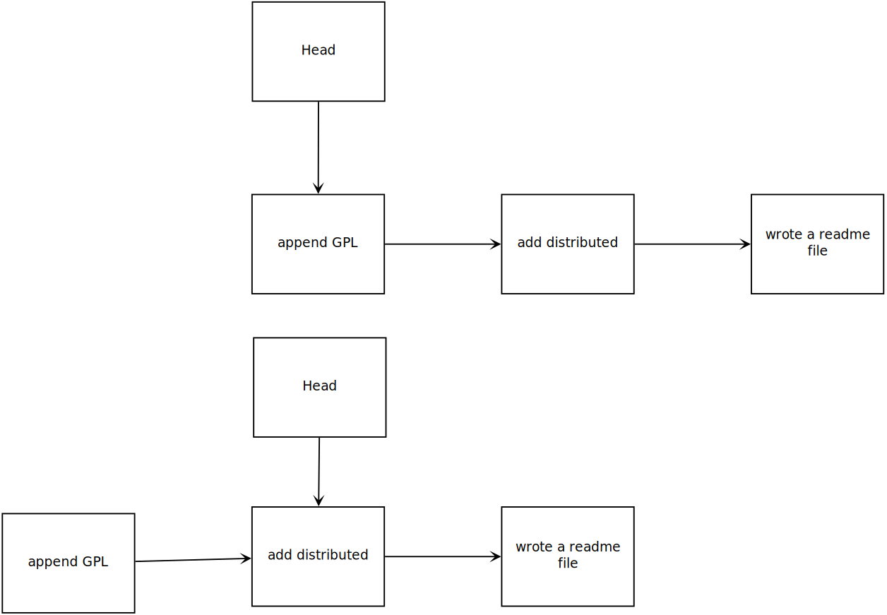
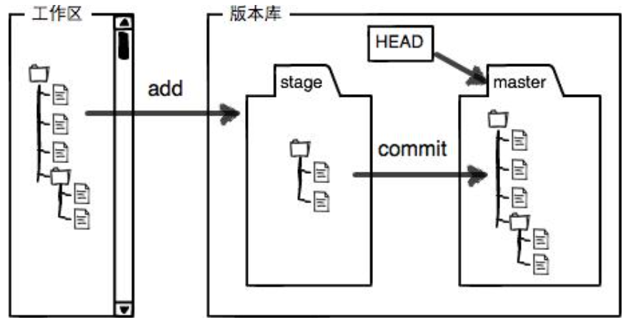

---

---

# git笔记

### 创建版本库

```bash
mkdir learngit	//创建名为learngit的文件夹
cd learngit     //切换文件目录到learngit
git init		//初始化learngit，建立一个git库
```

### 添加文件到版本库中

```bash
//编写一个readme.txt文件
/*内容：git is a version control system
	   git is free software*/
$git add readme.txt		//告诉git 将readme.txt添加到库
$git commit -m "wrote a readme.txt"	//告诉git，将readme.txt提交到库里
// -m "" 这是说明这次提交的名称，说明这次提交的内容大概是什么
```

提交文件到库种需要两步:1. git add ;2.git commit

### 查看库的状态

```bash
//将readme.txt中的内容修改后使用git status命令
$git status
On branch master
Changes not staged for commit:
  (use "git add <file>..." to update what will be committed)
  (use "git restore <file>..." to discard changes in working directory)
        modified:   readme.txt

no changes added to commit (use "git add" and/or "git commit -a")
//显示的意思是readme文件被修改单位提交修改后的版本
```

git status是用来查看库的当前状态

### 查看文件版本

```bash
$ git diff readme.txt //查看文件修改的内容
diff --git a/readme.txt b/readme.txt
index 46d49bf..9247db6 100644
--- a/readme.txt
+++ b/readme.txt
@@ -1,2 +1,2 @@
-Git is a version control system.
+Git is a distributed version control system.
 Git is free software.
```

git diff 查看某个文件的差异

###   查看版本历史记录

```bash
$ git log
commit 2586098ad0854abda8bc36b7d7a97a3a90940310 (HEAD -> master)
Author: lzh <xxxxxxx@163.com>
Date:   Fri Mar 12 18:04:32 2021 +0800

    append GPL

commit d4f1ea861cc2db93cd41e68bba8f15787b1c799b
Author: lzh <xxxxxxx@163.com>
Date:   Fri Mar 12 18:02:59 2021 +0800

    add distributed

commit b21cf8675679bc17abf46587bdb57b8363dcec6e
Author: lzh <xxxxxxx@163.com>
Date:   Fri Mar 12 17:37:14 2021 +0800

    wrote a readme file

```

上面是三次递交的全部信息，而信息太多不好查看，可以用--pretty=online参数

```bash
$ git log --pretty=oneline
2586098ad0854abda8bc36b7d7a97a3a90940310 (HEAD -> master) append GPL
d4f1ea861cc2db93cd41e68bba8f15787b1c799b add distributed
b21cf8675679bc17abf46587bdb57b8363dcec6e wrote a readme file
//前面的一串乱码数字是commit id
```

### 回溯到上一个版本、重回最新版本

```bash
$ git reset --hard HEAD^	//回溯上一版本
HEAD is now at d4f1ea8 add distributed

$ cat readme.txt		//查看readme.txt文件内容
git is a distributed version control system.
git is free software distributed under the GPL.

$ git log
commit d4f1ea861cc2db93cd41e68bba8f15787b1c799b (HEAD -> master)
Author: lzh <15612191579@163.com>
Date:   Fri Mar 12 18:02:59 2021 +0800

    add distributed

commit b21cf8675679bc17abf46587bdb57b8363dcec6e
Author: lzh <15612191579@163.com>
Date:   Fri Mar 12 17:37:14 2021 +0800

    wrote a readme file
    
$ git reset --hard 2586			//通过commit id号重回最新版本，id号只用前面几位，git自动查找
HEAD is now at 2586098 append GPL

$ git log --pretty=oneline
2586098ad0854abda8bc36b7d7a97a3a90940310 (HEAD -> master) append GPL
d4f1ea861cc2db93cd41e68bba8f15787b1c799b add distributed
b21cf8675679bc17abf46587bdb57b8363dcec6e wrote a readme file

$ git reflog	//该命令是用来查询你的每一次命令，让安心回溯以前版本
2586098 (HEAD -> master) HEAD@{0}: reset: moving to 2586
d4f1ea8 HEAD@{1}: reset: moving to HEAD^
2586098 (HEAD -> master) HEAD@{2}: reset: moving to HEAD
2586098 (HEAD -> master) HEAD@{3}: commit: append GPL
d4f1ea8 HEAD@{4}: commit: add distributed
b21cf86 HEAD@{5}: commit (initial): wrote a readme file

```

**git reset  ----head**中参数head是指向当前版本的指针，而之前回溯上一版本只是将head往回移一个位置



### git工作范围的概念

工作区是指你git初始化的那个文件夹，如廖雪峰老师中实例的learngit文件夹

而版本库是指工作区中隐藏的.git文件夹，而.git文件夹中有许多文件，而stage文件成为暂存区，Head文件则是指向master分支的指针



### git的核心思想

Git追踪的是修改，而不是文件，是每次增加，删除，替换等

### 撤销修改

```bash
$ cat readme.txt	//增加了最后一句话
git is a distributed version control system.
git is free software distributed under the GPL.
Git has a mutable index called stage.
git has a mutable index called stage
git tracks changes of files
my stupid boss still prefeers SVN

$ git status	//查看状态
On branch master
Changes not staged for commit:
  (use "git add <file>..." to update what will be committed)
  (use "git restore <file>..." to discard changes in working directory)
        modified:   readme.txt

no changes added to commit (use "git add" and/or "git commit -a")

$ git checkout -- readme.txt  //丢弃工作区的修改
$ cat readme.txt
git is a distributed version control system.
git is free software distributed under the GPL.
Git has a mutable index called stage.
git has a mutable index called stage
git tracks changes of files

//如果已经提交到暂存区后，如何撤销修改
$ git $ git status
On branch master
Changes to be committed:
  (use "git restore --staged <file>..." to unstage)
        modified:   readme.txt
 readme.txt
$ git reset HEAD readme.txt	//git reset不仅可以回溯版本，还可以将暂存区的修改退回工作区
Unstaged changes after reset:
M       readme.txt
$ git status
On branch master
Changes not staged for commit:
  (use "git add <file>..." to update what will be committed)
  (use "git restore <file>..." to discard changes in working directory)
        modified:   readme.txt

no changes added to commit (use "git add" and/or "git commit -a")
```

### 删除文件

```bash
$ git add test.txt	//添加文件到暂存区
$ git commit -m "add test.txt"		//将test文件从暂存区提交到master分支上
[master c5d93ab] add test.txt
 1 file changed, 1 insertion(+)
 create mode 100644 test.txt
$ rm test.txt	//删除test文件
$ git status	
On branch master
Changes not staged for commit:
  (use "git add/rm <file>..." to update what will be committed)
  (use "git restore <file>..." to discard changes in working directory)
        deleted:    test.txt

no changes added to commit (use "git add" and/or "git commit -a")
//显示工作区和版本库中不一致，提示你可以用两种方法
// 1.确定删除版本库的文件，使用git rm命令
// 2.错误操作，删除错误，可以用git restore命令恢复--git checkout 同样也可以恢复
$git checkout -- test.txt
$ git status
On branch master
nothing to commit, working tree clean

$ rm test.txt
$ git restore test.txt
$ git status
On branch master
nothing to commit, working tree clean
```

### 远程仓库

1.  首先本地创建ssh
2.  将ssh的公钥放入你的个人账号上
3.  就可以通过远程提交commit

