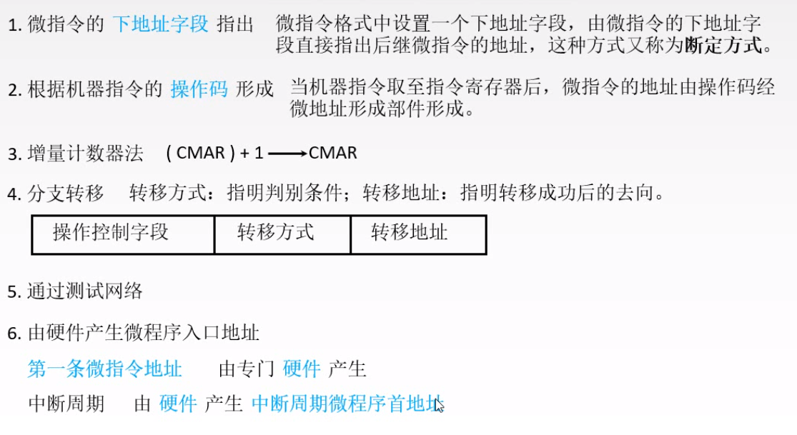
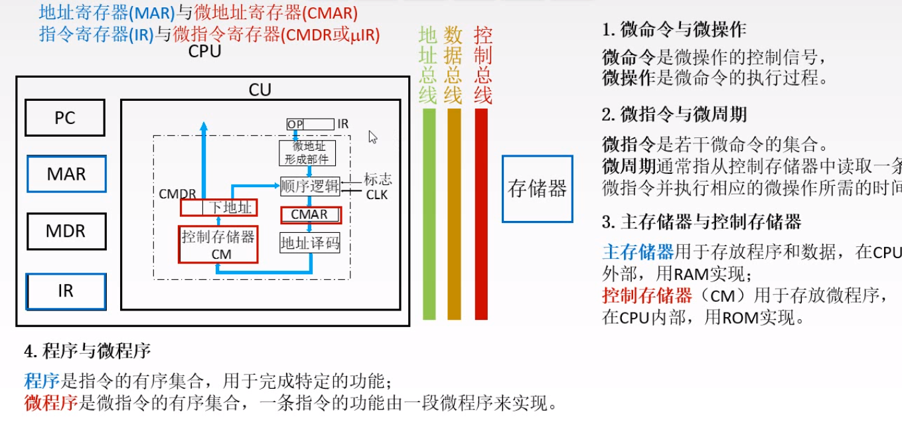

## 5.4 控制器

###  控制器的功能和结构

1.  取指令，指向下一条指令
2.  对指令译码，产生控制信号
3.  指挥数据流动方向

#### 控制单元的输入和输出

1.  输入

    指令寄存器

    时钟

    标志

    外来信号

2.  输出

    cpu内部的控制信号

    到控制总线的控制信号

### CU的设计

#### 硬布线控制器

IR对组合逻辑不友好，IR是二进制编码，一个编码对应一个状态而CU是一个位对于一个状态，因此需要操作码译码器

通常以存取周期作为基准时间，即机器周期

##### 设计步骤

1.  分析微操作序列
2.  选择CPU的控制方式---产生不同微操作命令序列所有的时许控制方式
    1.  同步控制方式--来自一个统一的时钟信号，控制电路简单，运行速度慢
    2.  异步控制方式---通过应答方式进行联络，运行快，控制电路复杂
    3.  联合控制方式，大部分采用同步控制，小部分用异步控制
3.  安排微操作时序

ps:中断周期三个任务：1.保存端点；2.形成中断服务程序的入口地址；3.关中断

电路设计

​	组合逻辑设计

​	设计步骤；1.列出操作时间表；2.写出微操作的最简单表达式；3.画出逻辑图

#### 微程序

**基本思想：将微操作控制信号存储在一个专门的存储器中，用寻址的方法找到指令**

微命令=微操作的控制信号，微操作=微命令的执行过程

相容性微命令与互斥性微命令

**基本机构**

 

CM:

微指令的格式

1.  水平型微指令：一次定义并执行多个平行操作

    

    

2.  垂直型微指令 

    

3.  混合型微指令

如何表示一系列控制信号

1.  直接编码--一个为代表微操作命令

2.  字段直接编码--将控制字段分成n个段，将段译码后发出控制信号

    

    字段分段原则；1.互斥在同段，相容不同段；2. 段中位不能大多；3. 每段保留一个状态码

    优点：缩短字长

    缺点：运行慢

3.  字段间接编码

4.  

微指令的地址形成方式

**断定方式**

##### 微程序控制单元的设计

步骤：1.分析微操作序列；2.写出微操作命令以及节拍安排；3.确定微指令格式；4.编写微指令码点

PS

##### **微程序控制的基本概念**

#### 硬布线与微程序的比较

