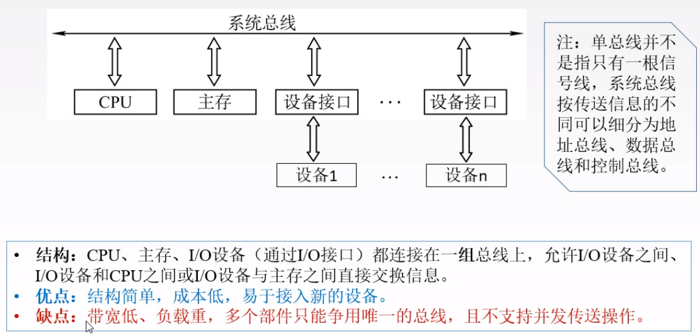

# 总线I/O

### 概述

总线是计算机分时共享的公共信息传送的线路

为什么引入总线？

##### 总线的特性

1.  机械特性
2.  电气特性
3.  功能特性
4.  时间特性

##### 总线分类

1.  按数据传输格式

    1.  串行总线

        

    2.  并行总线

        
        
        

2.  按总线的功能

    1.  片内总线：芯片内部的总线

    2.  系统总线：连接各部件的总线

        1.  数据总线：传输数据信息（指令，操作）

            **PS**：

        2.  地址总线：传输地址信息（内存，I/O端口地址）

        3.  控制总线：传输控制信，一根线控制一个信号

    3.  通信总线

        计算机之间的线路

3.  按时序控制方式

    1.  同步总线
    2.  异步总线

##### 系统总线结构

单总线结构

双总线结构

三总线结构

四总线结构

#### 性能指标

1.  总线的传输周期----一次总线操作所需的时间

    申请阶段，寻址阶段，传输阶段和结束阶段----通常n个总线时钟周期构成

2.  总线时钟周期=机器的时钟周期

3.  总线的工作频率

    **实际指一秒内传送几次数据**

4.  总线时钟频率

    **指一秒内有几个时间周期**

5.  总线宽度

    同时传输的数据位数

6.  总线带宽

    单位时间传输数据的位数----达到的最高传输速率

7.  有效数据传输率

    实际传输的数据除以耗时

8.  总线复用

    一种信号在不同时间传输不同的信息

9.  信号线数

    地址，数据和控制总线的总和

PS

### 总线仲裁

定义：同一时刻只有一个设备控制总线传输操作

主设备：能获得总线控制权的设备

从设备：被主设备访问的设备，只能响应命令

#### 集中仲裁方式

##### 链式查询

##### 计算器查询

##### 独立请求方式

##### 对比

#### 分布式总裁方式

### 操作和定时

总线周期的阶段

1.  申请分配：申请总线控制权
2.  寻址：
3.  传输
4.  结束阶段

总线定时：如何安排四个阶段顺序进行

1.  同步通信：统一时钟
2.  异步通信：应答方式
3.  半同步：同步异步结合
4.  分类式

### 总线标准

系统总线标准 

设备总线标准

局部总线标准